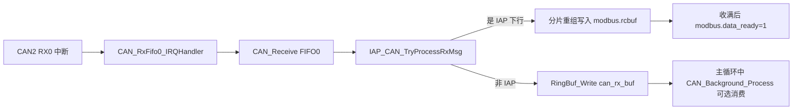
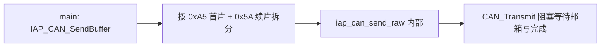

# STM32F407ZGT6 Bootloader / IAP（CAN 总线）

面向 **STM32F407ZGT6** 的片上 Flash **在线升级（IAP）** 工程，使用 **Keil MDK** 构建。**升级数据经 CAN2 传输**；应用层协议（握手、擦除、下载、校验）与原先 RS485 流式帧的**字节内容与校验规则一致**，仅增加 **CAN 8 字节分片** 作为传输层。

---

## 一、项目定位与 Flash 布局

| 区域         | 地址（以 `User/IAP/iap.h` 为准）      | 说明                                                         |
| ------------ | ------------------------------------- | ------------------------------------------------------------ |
| Bootloader   | `0x08000000` 起                       | 本工程；注释中预留约 **64KB** 给 Boot，须与 **分散加载（.sct）** 一致。 |
| 应用程序 App | **`0x08004000`**（`FLASH_APP1_ADDR`） | 升级目标区；App 链接脚本起始地址须与此对齐。                 |
| Flash 末尾   | **`0x08100000`**（`FLASH_END_ADDR`）  | 1MB 片上 Flash 上界，握手时用于区间合法性判断。              |

**数据分包**：按 **`APP_FLASH_CHUNK_SIZE`（1024 字节）** 分块擦除/下载/校验，与主机侧约定一致。

**超时进 App**：主循环在 **`Timer_Bt >= 2`** 且 **`DownLoadFlag == 0`** 时调用 **`Read_FlashToApp()`**。`Timer_Bt` 在 **TIM3** 更新中断中递增（约 **500ms/次**），故 `>=2` 约 **1s** 量级（以 `User/TIM/bsp_basic_tim.c` 中 `TIM3_Int_Init` 为准）。

---

## 二、CAN 通信（IAP 专用）

### 2.1 硬件

| 项目   | 配置                                                         |
| ------ | ------------------------------------------------------------ |
| 控制器 | **CAN2**（F407 上 CAN2 依赖 CAN1 时钟，工程已按 ST 惯例初始化） |
| 引脚   | **PB12** RX，**PB13** TX（见 `User/hardwareConfig/configuration.h`） |
| 波特率 | **125 kbps**（`configuration.c` 中 `CAN_Prescaler` 等与 APB1=42MHz 匹配） |

### 2.2 节点与扩展帧 ID

节点号在 **`User/IAP/iap.h`**：**`IAP_CAN_NODE_ID`**（默认 **`0x0A`**），须与上位机一致。

| 方向          | 扩展帧 ID（29 位逻辑值）           |
| ------------- | ---------------------------------- |
| 上位机 → 设备 | **`0x18F00000 | IAP_CAN_NODE_ID`** |
| 设备 → 上位机 | **`0x18F10000 | IAP_CAN_NODE_ID`** |

CAN 过滤器在 **`IAP_CAN_FilterInit()`**（`User/can/bsp_iap_can.c`）中配置，**过滤器编号 16**，与原有电源协议过滤器（14、15）并存。

### 2.3 分片格式（每帧 DLC ≤ 8）

重组后的 **`modbus.rcbuf`** 内容与**原串口单帧**相同（含末尾校验字节）。

- **首片**：`Data[0] = 0xA5`；`Data[1..2]` 为整包长度 **uint16 小端**；`Data[3..7]` 为应用数据前最多 **5** 字节。
- **续片**：`Data[0] = 0x5A`；`Data[1..2]` 为当前负载在重组缓冲中的 **偏移（小端）**；`Data[3..7]` 最多 **5** 字节。最后一帧 DLC 可小于 8。

接收在 **`CAN_RxFifo0_IRQHandler`**（`User/can/bsp_can.c`）中优先调用 **`IAP_CAN_TryProcessRxMsg()`**；若为 IAP 帧则**不再入** RingBuffer，避免与电源业务 CAN 解析混用。

发送使用 **`IAP_CAN_SendBuffer()`**（阻塞式占用发送邮箱，**不**使用 `can_tx_buf` 队列）。

清接收与状态：**`IAP_RxBufferClear()`**（会清 `modbus` 与内部分片状态）。

### 2.4 CAN 通信流程（数据路径总览）

工程里 CAN 分为两条独立数据面：**Bootloader IAP**（与升级强相关）和 **演示/电源协议**（RingBuffer + 后台任务，可选）。

#### 初始化顺序（`CAN_Config` 及相关）

1. **`configuration.c` → `CAN_Config()`**：去初始化 CAN2、配置波特率/模式、配置过滤器 bank 14/15（原 0xC/0xF 系列业务 ID 掩码）。
2. **`IAP_CAN_FilterInit()`**：增加过滤器 **bank 16**，仅放行 IAP 下行扩展帧 `0x18F00000 | IAP_CAN_NODE_ID` 到 FIFO0。
3. **`CAN_RingBuffers_Init()`**：把 `can_rx_buf` / `can_tx_buf` 与静态 `CAN_Frame_t` 数组绑定（`RingBuf_Init`）。
4. **`CAN_ITConfig(CANx, CAN_IT_FMP0, ENABLE)`**：FIFO0 非空中断；入口在 `stm32f4xx_it.c` 的 **`CAN_RX_IRQHandler` → `CAN_RxFifo0_IRQHandler`**。

#### 接收路径（中断内）



- **IAP**：`IAP_CAN_TryProcessRxMsg()` 识别扩展 ID 与 PCI（`0xA5`/`0x5A`），在 **`modbus.rcbuf`** 中拼出与旧 RS485 单帧相同的字节流；拼完后 **`modbus.data_ready = 1`**，`main.c` 中原 IAP 状态机即可运行。
- **非 IAP**：同一 ISR 内将帧写入 **`can_rx_buf`**，由 **`CAN_Background_Process()`** 弹出并进入各 **`CAN_Handle_*`**（若主循环未调用该函数，则业务帧仅积压在队列中）。

#### IAP 发送路径（应答，`main.c` 调用）



- **`IAP_CAN_SendBuffer()`**：对外唯一 IAP 发送 API；扩展 ID 为 **`0x18F10000 | IAP_CAN_NODE_ID`**（设备→上位机）。
- **`iap_can_send_raw()`**（`bsp_iap_can.c` 内 static）：单帧 `CAN_Transmit`，带超时取消；**不经过 `can_tx_buf`**，避免与演示协议发送队列混用。

#### 演示协议发送路径（可选，`CAN_Send_*` 系列）

1. **`CAN_LoadCommand()`**：填充演示用 `CanTxMsg`（固定演示 ExtId、`cmd`、`addr`）。
2. **`CAN_Enqueue_TxMsg()`**：压入 **`can_tx_buf`**。
3. **`CAN_Tx_Background_Process()`**：主循环中周期性调用时，按 **`CAN_TX_INTERVAL_MS`** 间隔从队列 Peek/Pop，**`CAN_Transmit`** 非阻塞状态机发送。

> **Bootloader 现状**：`main.c` 通常**不**调用 `CAN_Background_Process` / `CAN_Tx_Background_Process`，总线上与升级相关的收发以 **IAP 路径**为主；演示代码保留在 `bsp_can.c` 中便于扩展或联调。

#### 收发相关函数速查（IAP 与公用）

| 函数                        | 文件                  | 作用                          |
| --------------------------- | --------------------- | ----------------------------- |
| `IAP_CAN_FilterInit`        | `bsp_iap_can.c`       | 注册 IAP 下行 CAN 过滤器      |
| `IAP_CAN_TryProcessRxMsg`   | `bsp_iap_can.c`       | 中断内解析 IAP 分片并重组     |
| `IAP_CAN_SendBuffer`        | `bsp_iap_can.c`       | IAP 应答：分片 + 阻塞发送     |
| `IAP_RxBufferClear`         | `bsp_iap_can.c`       | 清空 `modbus` 与分片状态      |
| `CAN_RingBuffers_Init`      | `bsp_can.c`           | 初始化 `can_rx/tx_buf` 队列   |
| `CAN_RxFifo0_IRQHandler`    | `bsp_can.c`           | RX 中断：Receive → IAP 或入队 |
| `CAN_Enqueue_TxMsg`         | `bsp_can.c`（static） | 演示发送入队                  |
| `CAN_Tx_Background_Process` | `bsp_can.c`           | 演示发送出队与状态机          |
| `CAN_Background_Process`    | `bsp_can.c`           | 演示接收出队与事件分发        |

---

## 三、软件架构

### 3.1 主流程（`User/main.c`）

1. **初始化**：`RCC_Config` → `SysTick`（1ms）→ `GPIO_Config` → `USART_Config`（仅调试口）→ `CAN_Config` → `TIM_Config` → `TIM3_Int_Init` → `NVIC_Config` → `LED_Init` → `delay_init`。
2. **大循环**：
    - 超时且无下载进行时 **`Read_FlashToApp()`**。
    - **`modbus.data_ready == 1`** 时按 **`Flash_Status`** 处理**一帧 IAP 应用数据**（已由 CAN 层重组完成）。

### 3.2 IAP 状态机（`Flash_Status`）

| 宏                | 含义                                                         |
| ----------------- | ------------------------------------------------------------ |
| `BL_ST_HANDSHAKE` | 握手：校验和、魔数 `0x4C 0x57`，解析下载起止地址；非法则 NACK。 |
| `BL_ST_ERASE`     | 按序擦除扇区；`0x10` 表示擦除阶段结束并进入下一状态。        |
| `BL_ST_DOWNLOAD`  | 固件数据写入 Flash（大包长度约定如 **1028** 字节等，与主机一致）。 |
| `BL_ST_VERIFY`    | 回读校验。                                                   |
| `BL_ST_JUMP_APP`  | 跳转 App。                                                   |
| `BL_ST_ERROR`     | 异常；当前实现可跳转 App 或复位（见 `main.c`）。             |

### 3.3 模块与文件

| 模块                      | 路径 / 说明                                                  |
| ------------------------- | ------------------------------------------------------------ |
| **CAN IAP 分片**          | `User/can/bsp_iap_can.c`、`bsp_iap_can.h`                    |
| **CAN 驱动与 FIFO 入队**  | `User/can/bsp_can.c`；非 IAP 帧仍可走 RingBuffer / `CAN_Background_Process`（电源协议演示） |
| **IAP 缓冲与 Flash/校验** | `User/usart/bsp_usart.c`：`modbus`、`calculate_checksum`、`verify_checksum`、`Flash_*`、`STMFLASH_Read`（**已无 RS485/USART2 IAP 中断**） |
| **调试串口**              | **USART2**，**仅发送**（`fputc`），**PA2/PA3**，避免与 CAN IAP 接收冲突（`USART_Config` 中 `USART_Mode_Tx`） |
| **硬件与 CAN 初始化**     | `User/hardwareConfig/configuration.c`、`configuration.h`     |

### 3.4 目录结构

```
Bootloader_CAN/
├── Libraries/          # CMSIS + STM32F4xx 标准外设库
├── Project/            # Keil 工程（.uvprojx 等），含 bsp_iap_can.c
├── User/               # main、IAP、CAN、TIM、配置等
├── Listing/、Output/   # Keil 编译输出（建议 .gitignore）
└── README.md
```

---

## 四、上位机配合要点

- 将原 **RS485 连续字节流** 改为：按 **2.2** 的扩展帧 ID 发送，负载按 **2.3** 分片；设备应答同样经 CAN 分片返回，**重组后**与原先串口帧一致。
- **节点号** 与 **`IAP_CAN_NODE_ID`** 必须一致。

---

## 五、调试与可靠性

- **HardFault**：`User/stm32f4xx_it.c` 中 **`g_hardfault_dump`**；Watch 关注 **`pc`、`lr`、`cfsr`**。
- **栈空间**：启动文件中 **`Stack_Size`** 已加大；`main` 内大数组（如校验应答缓冲）注意栈使用。
- **清缓冲**：IAP 路径使用 **`IAP_RxBufferClear()`**，与 CAN 分片状态一致。
- **App 跳转**：确认 **`Flash_App_Addr`** 处向量表合法（栈顶在 RAM、入口 Thumb）。

---

## 六、构建说明

- **IDE**：Keil MDK，**`startup_stm32f40xx.s`**。
- 建议勿常规提交 **`Output/`**、**`Listing/`**；以 **`User/`**、**`Libraries/`** 与 **`README.md`** 为主。

---

## 七、CAN 通信使用情况整理

本节归纳**本仓库中 CAN 在 Bootloader 场景下的实际用法**，便于与上位机规格对齐。

### 7.1 Bootloader 主流程实际依赖的路径（IAP）

| 环节     | 行为                                                         | 代码位置                                                     |
| -------- | ------------------------------------------------------------ | ------------------------------------------------------------ |
| 初始化   | CAN2 波特率、过滤器 14/15（历史业务掩码）+ 过滤器 16（IAP 下行）、RX0 中断、环形缓冲绑定 | `configuration.c`：`CAN_Config()`、`IAP_CAN_FilterInit()`、`CAN_RingBuffers_Init()` |
| 接收     | FIFO0 中断读出帧 → **优先** IAP 分片解析                     | `bsp_can.c`：`CAN_RxFifo0_IRQHandler()` → `IAP_CAN_TryProcessRxMsg()` |
| 重组缓冲 | 完整 IAP 应用层报文写入 **`modbus.rcbuf`**，最大 **`USART_REC_LEN`（1054）** 字节 | `bsp_usart.h` / `bsp_iap_can.c`                              |
| 业务处理 | **`modbus.data_ready`** 置位后，`main.c` 中 **`Flash_Status`** 状态机处理握手/擦除/下载/校验 | `main.c`                                                     |
| 应答发送 | **`IAP_CAN_SendBuffer()`**：按 0xA5/0x5A 分片、扩展 ID **`0x18F10000 \| IAP_CAN_NODE_ID`**，内部 **`CAN_Transmit`** 阻塞 | `bsp_iap_can.c`                                              |
| 清接收   | **`IAP_RxBufferClear()`**：清空 `modbus` 与分片状态（关中断临界区） | `bsp_iap_can.c`                                              |

**结论**：升级业务**仅依赖**上述 IAP CAN 路径；与 RS485 时代的差异仅限于「字节流外包了一层 CAN 分片 + 固定扩展 ID」，**重组后的单帧格式、校验与状态机与原先一致**。

### 7.2 固件中存在、但 Bootloader `main` 未调用的路径（演示/扩展）

| 路径                                           | 作用                      | Bootloader `main.c` 现状                                     |
| ---------------------------------------------- | ------------------------- | ------------------------------------------------------------ |
| `can_rx_buf` 入队 + `CAN_Background_Process()` | 解析电源/演示协议回包     | **未调用** `CAN_Background_Process`，业务帧若出现会积压在队列（容量 100） |
| `can_tx_buf` + `CAN_Tx_Background_Process()`   | `CAN_Send_*` 演示命令发送 | **未调用** `CAN_Tx_Background_Process`，演示发送函数无后台出队 |

若仅需 IAP，上位机**不必**实现过滤器 14/15 对应 ID；若总线上仍有历史设备帧，应注意与 IAP ID **不要冲突**（IAP 使用独立 ID 段）。

### 7.3 关键参数速查

| 参数                      | 值 / 说明                                                    |
| ------------------------- | ------------------------------------------------------------ |
| CAN 控制器                | CAN2，PB12 RX / PB13 TX                                      |
| 波特率                    | 125 kbps（与 `configuration.c` 中位时序一致）                |
| 帧类型                    | **扩展数据帧**（IDE=Extended），IAP 使用 **标准数据帧以外的** 29 位 ID 规则见 §2.2 |
| 节点号                    | `IAP_CAN_NODE_ID`（默认 `0x0A`，见 `iap.h`），改固件须同步改上位机 |
| 单条 IAP 应用报文最大长度 | **1054** 字节（重组后长度字段合法范围 1～1054）              |
| Flash 应用区首址          | `0x08004000`；握手区段须与 `Flash_App_Addr` 等逻辑一致（见 `main.c` / `iap.h`） |

---

## 八、上位机（PC / 工具链）CAN 通信要求说明

以下为与**当前下位机实现严格匹配**的上位机开发要求，用于抓包器、自研上位机或测试脚本验收。

### 8.1 物理与链路层

- **接口**：与目标板 CAN2（PB12/PB13）及 **GND** 正确连接；**120Ω 终端**按网络拓扑在总线两端配置。
- **波特率**：**125 kbps**（与下位机 `CAN_Config` 一致；若改固件位时序，上位机须同步）。
- **帧格式**：IAP 仅使用 **扩展帧数据帧**（非远程帧）。采样点等细节由 CAN 控制器与收发器决定，上位机 CAN 适配器须能在该波特率下稳定收发。

### 8.2 扩展帧 ID 与寻址

设下位机编译期节点号为 **`NODE = IAP_CAN_NODE_ID`**（默认 **0x0A**）：

| 方向            | 29 位扩展 ID（十六进制，逻辑 ID） | 说明                                      |
| --------------- | --------------------------------- | ----------------------------------------- |
| 上位机 → 下位机 | **`0x18F00000 \| NODE`**          | 所有 IAP 命令、固件数据分片均用此 ID 发送 |
| 下位机 → 上位机 | **`0x18F10000 \| NODE`**          | 所有 IAP 应答分片均用此 ID 接收后重组     |

上位机须能 **发送** 第一种 ID、**监听** 第二种 ID（或 Promiscuous 接收后按 ID 过滤）。

### 8.3 传输层：分片与重组（上下行对称）

每帧 **DLC ≤ 8**，数据区布局如下（**小端 uint16**）：

**首片（Start of Fragment）**

| 字节         | 含义                                                         |
| ------------ | ------------------------------------------------------------ |
| `Data[0]`    | 固定 **`0xA5`**                                              |
| `Data[1..2]` | **`total_len`**：重组后**应用层**总字节数，uint16 小端，范围 **1～1054** |
| `Data[3..7]` | 应用层字节 **`[0 .. n-1]`**，**n = min(5, total_len)**       |

**续片（Continuation）**

| 字节         | 含义                                                         |
| ------------ | ------------------------------------------------------------ |
| `Data[0]`    | 固定 **`0x5A`**                                              |
| `Data[1..2]` | **`offset`**：本段数据在应用层缓冲中的起始下标，uint16 小端  |
| `Data[3..7]` | 应用层字节 **`[offset .. offset+m-1]`**，**m ≤ 5**，且 **`offset + m ≤ total_len`** |

**发送规则（上位机下发时须遵守）**

1. 每一轮新报文必须先发 **首片 0xA5**，`total_len` 为本报文应用层总长度。
2. 首片负载最多 5 字节；剩余部分按 **offset 连续递增** 发若干 **0x5A** 续片；**`offset` 必须等于当前已写入长度**（与下位机 `modbus.rx_count` 严格衔接），否则下位机丢弃重组状态。
3. 最后一帧 DLC 可为 **4～8**（至少 3 字节头 + 至少 1 字节负载，当下行仍有余量时）。
4. 重组完成后下位机才会处理该报文；**不要在重组未完成时交错发送另一套首片**（会覆盖当前缓冲）。

**接收规则（解析下位机应答）**

- 下位机使用**相同** 0xA5 / 0x5A 规则、**应答 ID** 为 **`0x18F10000 \| NODE`**。
- 上位机须用**同一套重组算法**还原完整字节流，再进入应用层解析。

### 8.4 应用层：重组后的 IAP 报文（与历史 RS485 一致）

重组得到连续字节数组 **`P[0 .. L-1]`** 后：

- **校验**：须满足下位机 `verify_checksum(P, L)`：**前 L-1 字节之和的最低字节等于 `P[L-1]`**。
- **状态与长度**：不同阶段 `L` 与内容不同，由下位机 `main.c` 分支约定（与旧版串口 IAP 相同），包括但不限于：
    - 握手：**14** 字节级报文；
    - 擦除阶段：**5** 字节级报文；结束擦除首字节 **`0x10`**；
    - 下载：**1028** 字节级报文（含校验字节）；
    - 校验：请求 **4** 字节级；大包应答 **1028** 字节级；结束校验命令首字节 **`0x0D`** 等。

具体字段布局以实现为准（见 `User/main.c` 各 `case`）；上位机应与原 RS485 工具**同一套应用层协议**对齐，仅将「串口写读」替换为「CAN 分片发送/接收重组」。

### 8.5 下载区间与 Flash 约束（握手内容）

下位机要求（默认 App 首址 **`0x08004000`**）：

- 握手给出的 **起始地址** 须与当前 **`Flash_App_Addr`**（初值多为 `FLASH_APP1_ADDR`）**一致**，否则 NACK。
- **结束地址**须 **大于起始地址** 且 **不大于 `0x08100000`**（`FLASH_END_ADDR`）。

上位机在组握手帧时应使用与目标镜像一致的链接范围。

### 8.6 超时与重试（与下位机行为相关）

- 下位机在 **`Timer_Bt >= 2`** 且未进入下载流程时可能 **跳转 App** 或 **握手超时分支**（约 **1s** 量级，取决于 TIM3 配置）。
- 建议上位机：**握手阶段**在 **500ms～1s** 内完成有效帧；各阶段在合理时间内发完**完整分片组**，避免半包长期悬挂。
- 下位机应答为 **阻塞发送**，多帧应答期间会持续占用发送邮箱；上位机应 **收齐全部应答分片** 再发下一笔业务。

### 8.7 版本与配置同步检查清单

上位机发布前建议核对：

- [ ] 波特率 **125 kbps**
- [ ] 扩展 ID：**`0x18F00000|NODE` / `0x18F10000|NODE`**，**NODE** 与固件 `IAP_CAN_NODE_ID` 一致
- [ ] 分片：**0xA5 / 0x5A**、`total_len` 与 `offset` 连续
- [ ] 应用层：重组后长度与 **校验字节** 符合 `verify_checksum`
- [ ] 握手地址与 **`FLASH_APP1_ADDR` / `FLASH_END_ADDR`** 策略一致

---

*文档随工程演进更新。*
